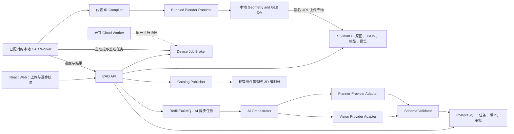
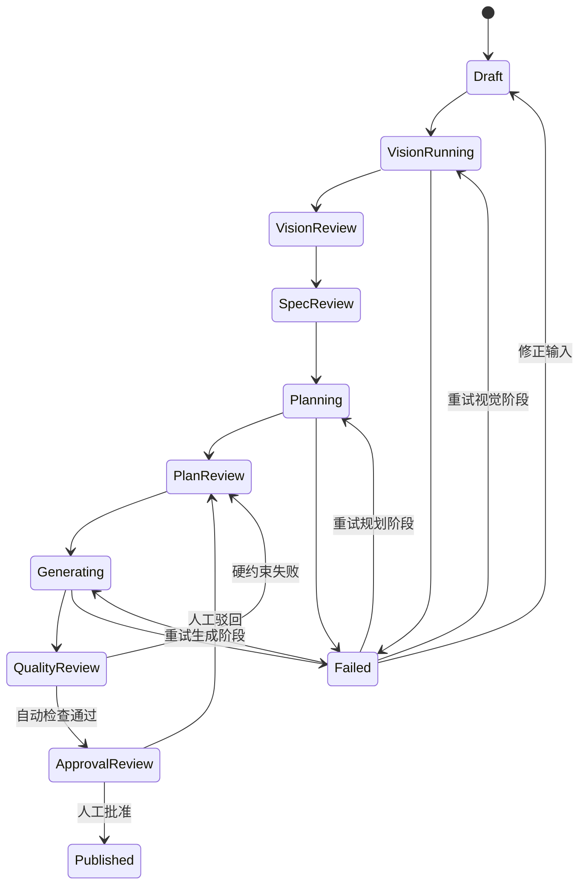

# AI CAD Agent 人机协同组件建模流水线设计（2026-07-11）

> 状态：APPROVED（2026-07-11）  
> 模式：公司内部生产工具优先，后续可扩展为用户功能  
> 推荐路线：受约束几何 IR + Agent Planner，产品族模板兜底

## 1. 问题与目标

当前组件模型由负责人在 Blender 中手工建立。一个典型模型平均约 10 分钟，当前待建约 30 个，即眼前约 5 小时的建模工作；更重要的是，组件库会持续增长，后续还计划让用户上传网上看中的商品图并生成可用于 Web 3D 展示的组件模型。

本功能的目标不是让 LLM 自由编写一段 Blender 脚本后直接执行，而是建立一条可校准、可回放、可审计、可失败恢复的人机协同生产线：

1. 从带尺寸的单张斜视商品图提取可见结构和尺寸证据。
2. 由用户确认尺寸、板件、结构关系、孔径和孔位。
3. 由 Planner 把已确认信息转换成受约束的参数化建模计划。
4. 由确定性编译器把建模计划转换为 `bpy` 脚本。
5. 在隔离的 Blender Worker 中生成、校验并导出模型。
6. 用户确认预览后，将 GLB、缩略图和元数据发布到现有组件 Catalog。

核心效率指标是把典型组件的人工时间从约 10 分钟降低到建议目标 3 分钟以内，同时避免尺寸、孔位和错误模型进入正式组件库。

## 2. 已确认范围

### 2.1 输入

- 首版主要输入：单张斜视角、带尺寸标注的商品图。
- 用户在流程中人工校准尺寸，并人工标注孔径和孔位。
- 后续可以增加多图、三视图和工程图，但不能让这些输入形式阻塞首版。

### 2.2 支持的产品结构

首版覆盖：

- 板件和跳台。
- 梯子。
- 盒体猫屋。
- 圆柱抓柱。
- 软体织物。
- 圆形、圆弧和规则曲面。

首版不覆盖任意自由曲面和不规则雕塑造型。软体织物采用模板化近似，不与硬质结构共用精密拓扑承诺。

### 2.3 精度定义

以下属于硬约束：

- 整体外形尺寸。
- 每块板件尺寸。
- 孔径。
- 孔中心位置和孔轴方向。

以下属于软约束：

- 图片中不可见的内部遮挡结构。
- 没有明确标注的板厚。
- 非施工相关的细节、倒角和装饰。

硬约束数值必须由图片中的明确标注或用户确认产生。AI 可以提出候选值，但不能把推断值自动升级为已确认值。

建议首版验收阈值：已确认尺寸和孔位在生成模型中的误差不超过 1 mm。这里衡量的是“确认值到生成模型”的编译误差，不是要求 AI 从单图自动猜中所有真实尺寸。

### 2.4 输出

- 主输出：`glb`，用于当前 Web 3D 编辑器。
- 生产留档：`blend`、生成所用 `bpy`、版本化组件 JSON、质量报告。
- 可选导出：`obj`、`fbx`、`stl`。
- 首版不承担 STEP、CNC、数控加工或制造级 CAD 输出责任。

## 3. 与当前项目的关系

当前工程已经具备可复用基础：

- `/components_manager` 组件管理页。
- `ComponentCatalogItem` 及其本地管理、迁移和参数 Schema。
- `assetKey` / `assetUrl` 和 GLB 加载失败回退。
- `public/models/cat-wall/` 内置资产 registry。
- GLB 缩略图和 3D 场景预览。
- 墙面、地面、自由组件的放置语义。
- 组件尺寸、材质颜色、部件显隐和尺寸轴参数绑定。
- 项目本地持久化、施工图和 BOM 基础。

当前还不具备：

- 服务端 API。
- 数据库和对象存储。
- 任务队列、异步状态和失败重试。
- 模型供应商适配层。
- Blender 执行环境和隔离 Worker。
- 服务端组件 Catalog 和资产审核发布流程。

本机环境检查结果也显示当前没有全局 `blender` 和 `docker` 命令。因此编码前必须先固定 Blender 版本和可复现的 Worker 运行环境。

AI CAD Agent 不应直接修改现有 `componentAssetRegistry` 源码。短期可以生成待人工复制的内置资产记录，正式方案应把生成资产作为服务端 Catalog 数据，通过稳定 URL 被前端消费。

## 4. 核心架构决策

### 4.1 使用三层中间数据，不让 LLM 直接控制 Blender

流水线保留三个不同语义的 JSON：

1. `VisionObservation`：模型从图片中看到了什么，包含证据、置信度和歧义。
2. `ComponentSpec`：用户已经确认的产品事实，是后续建模的事实来源。
3. `ModelingPlan`：如何用受支持的几何原语和操作构造模型。

`bpy` 由代码中的确定性编译器从 `ModelingPlan` 生成。LLM 不允许输出可直接执行的 Python，不允许提供文件路径、Shell 参数或 Blender 插件代码。

### 4.2 模板是快捷方式和兜底，不是第二套数据模型

板件、梯子、盒体、圆柱、软梯和圆弧模板最终都展开成相同的 `ModelingPlan`。这样模板生成和 Agent 生成共享校验器、编译器、QA 和导出逻辑。

### 4.3 毫米是业务数据单位，米是 Web 渲染单位

- `VisionObservation`、`ComponentSpec` 和 `ModelingPlan` 中所有长度统一使用毫米。
- Blender 场景可以使用毫米语义建模，但导出 GLB 前统一换算为米。
- 现有 `defaultSize` 继续以米表示，发布适配器负责从 `actualSizeMm` 转换。
- 金额、角度、坐标轴和长度字段禁止使用无单位裸值。

### 4.4 孔是一级业务对象

孔不能只表现为匿名 Boolean。每个孔必须保留：

- 稳定 ID。
- 所属板件。
- 孔径、深度或通孔标记。
- 中心点和轴方向。
- 数值来源。
- 用户确认记录。

建模时孔可以编译为 Difference Boolean，但施工图和质量报告读取的是孔语义，而不是反向分析网格。

### 4.5 发布与生成分离

生成成功不等于进入组件库。只有通过自动 QA 并由用户明确批准的模型才能发布。任何阶段都应保留上一版已批准资产，重新生成不能覆盖线上版本。

### 4.6 执行后端可替换，内部版强制本地 Worker

内部版本要求使用者安装本地 Worker，Blender 生成和几何 QA 默认使用本机 CPU、内存和磁盘。云端负责 AI 调用、任务状态、版本、对象存储和 Catalog 发布，不承担首期 Blender 算力。

任务模型仍保留 `executionBackend: local-device | cloud-worker` 抽象。首期只实现 `local-device`；未来如对外开放，可增加“本地优先、云端按配额或付费兜底”，而不改变 `ComponentSpec`、`ModelingPlan` 和发布协议。

## 5. 总体系统架构



AI 调用通过云端队列运行；Blender 任务由本地 Worker 主动通过 HTTPS 拉取。Web 端只负责提交任务、选择已配对设备、编辑阶段产物、批准和查看进度，不直接启动本地进程，也不要求浏览器访问本机端口。

## 6. 人机协同流水线

### 6.1 阶段定义

| 阶段 | 自动产物 | 人工校准 | 通过条件 |
|---|---|---|---|
| 1. 输入检查 | 图片格式、尺寸、哈希、方向和安全检查 | 裁剪主体、确认图片可用 | 图片可读取且主体明确 |
| 2. 视觉识别 | 尺寸标注、可见板件、轮廓、候选产品族、歧义列表 | 修正 OCR、绑定尺寸线与对象 | 至少确认整体尺寸和比例基准 |
| 3. 结构校准 | 候选板件、连接关系和隐藏结构建议 | 增删板件、修改尺寸、选择模板 | 所有硬约束字段完整 |
| 4. 孔位校准 | 可见孔候选 | 用户标注孔径、孔位、所属板件和轴向 | 所有施工孔均明确确认 |
| 5. Planner | 受约束 `ModelingPlan` | 调整原语、层级、Boolean、Mirror、Array | JSON Schema 和语义校验通过 |
| 6. Blender 生成 | 本地 Worker 生成 `bpy`、`blend`、`glb`、可选格式 | 选择在线设备；失败时返回前一步修改 | Worker 版本兼容、正常退出且产物完整上传 |
| 7. 自动 QA | 尺寸、孔位、法线、材质、面数、文件大小报告 | 查看错误和警告 | 硬约束全通过 |
| 8. 视觉审批 | 多角度渲染和 Web GLB 预览 | 批准、驳回或创建修订版 | 用户明确批准 |
| 9. Catalog 发布 | Catalog 条目、缩略图、稳定资产 URL | 补商品名称、分类、价格等业务字段 | 生成新的已发布资产版本 |

### 6.2 状态机



每次人工保存或自动阶段执行都增加 `revision`。所有执行接口必须携带期望 revision，防止旧任务覆盖用户的新修改。

## 7. 核心数据契约

以下是字段方向，不是最终完整 Schema。正式编码前应把 JSON Schema 放在独立版本目录，并生成 TypeScript 与 Python 类型或校验代码。

### 7.1 VisionObservation

```json
{
  "schemaVersion": 1,
  "jobId": "cadjob_01...",
  "productFamilyCandidates": [
    { "family": "box-house", "confidence": 0.88 }
  ],
  "dimensionEvidence": [
    {
      "id": "dim_01",
      "label": "整体宽度",
      "valueMm": 580,
      "imageRegion": [0.12, 0.08, 0.76, 0.18],
      "ocrText": "580mm",
      "confidence": 0.96,
      "status": "proposed"
    }
  ],
  "partCandidates": [
    {
      "id": "part_candidate_01",
      "kind": "box",
      "label": "背板",
      "imagePolygon": [[0.2, 0.2], [0.7, 0.2], [0.7, 0.8], [0.2, 0.8]],
      "visible": true,
      "confidence": 0.91
    }
  ],
  "ambiguities": [
    {
      "code": "HIDDEN_BACK_STRUCTURE",
      "message": "背部连接结构不可见，需要选择模板或人工补充。"
    }
  ]
}
```

置信度只用于排序和提示，不能替代用户确认状态。

### 7.2 ComponentSpec

```json
{
  "schemaVersion": 1,
  "unit": "mm",
  "name": "大猫房子-右",
  "family": "box-house",
  "placement": "wall",
  "overallSizeMm": { "x": 580, "y": 380, "z": 300 },
  "parts": [
    {
      "id": "back-panel",
      "label": "背板",
      "shape": "rect-panel",
      "sizeMm": { "x": 580, "y": 380, "z": 15 },
      "sizeStatus": "confirmed",
      "materialRole": "wood"
    }
  ],
  "holes": [
    {
      "id": "mount-hole-left-top",
      "partId": "back-panel",
      "centerMm": { "x": -240, "y": 150, "z": 0 },
      "axis": { "x": 0, "y": 0, "z": 1 },
      "diameterMm": 8,
      "through": true,
      "source": "user",
      "status": "confirmed"
    }
  ],
  "assumptions": [
    {
      "field": "parts.back-panel.sizeMm.z",
      "reason": "图片未标注板厚，采用产品族默认值",
      "severity": "info"
    }
  ]
}
```

进入 Planner 前必须满足：

- `overallSizeMm` 已确认。
- 每个硬质板件的长宽已确认。
- 所有施工孔的直径、中心、轴和所属板件已确认。
- 未确认字段都有显式默认来源或阻断错误。

### 7.3 ModelingPlan

首版 IR 建议包含以下节点：

- 原语：`box`、`cylinder`、`tube`、`sphere-segment`、`extruded-profile`、`revolved-profile`、`curved-panel`。
- 组合：`assembly`、`parent`、`transform`。
- 操作：`boolean-union`、`boolean-difference`、`mirror`、`linear-array`、`radial-array`。
- 语义对象：`mounting-hole`、`material-slot`、`soft-template-instance`。

```json
{
  "schemaVersion": 1,
  "componentSpecRevision": 4,
  "coordinateSystem": {
    "handedness": "right",
    "up": "+Y",
    "front": "+Z",
    "unit": "mm"
  },
  "nodes": [
    {
      "id": "back-panel-solid",
      "op": "box",
      "sizeMm": { "x": 580, "y": 380, "z": 15 },
      "transform": {
        "positionMm": { "x": 0, "y": 0, "z": 7.5 },
        "rotationDeg": { "x": 0, "y": 0, "z": 0 }
      },
      "partId": "back-panel"
    },
    {
      "id": "mount-hole-left-top",
      "op": "mounting-hole",
      "targetNodeId": "back-panel-solid",
      "diameterMm": 8,
      "centerMm": { "x": -240, "y": 150, "z": 7.5 },
      "axis": "+Z",
      "through": true
    }
  ],
  "export": {
    "primary": "glb",
    "optional": ["blend", "obj", "fbx", "stl"],
    "originPolicy": "bounding-box-center",
    "applyTransforms": true
  }
}
```

### 7.4 坐标与资产规范

为兼容当前组件放置语义，发布资产统一遵守：

- 右手坐标系，`+Y` 向上。
- 墙面组件本地 `X` 为宽，`Y` 为高，`Z` 为离墙深度，正面朝 `+Z`。
- GLB 导出单位为米。
- 可见网格的包围盒中心归一到原点；接触面和安装面的变换另存为元数据。
- 生成后重新计算 `actualSizeMm`，不得只信任输入参数。
- 材质槽使用稳定语义名，例如 `wood-primary`、`metal-fastener`、`fabric-primary`。
- 部件节点保留稳定 `partId`，支持现有的材质和显隐参数绑定。

## 8. Planner 和模型供应商设计

### 8.1 两个模型阶段

Vision 和 Planner 必须拆分：

- Vision 负责图片证据提取，不负责决定 Blender 操作。
- Planner 只读取已确认 `ComponentSpec` 和支持的 IR 能力清单，不重新猜测尺寸。

这样可以单独替换或评测 GPT 系列和 Qwen-VL 系列模型。建议配置：

```text
VISION_PROVIDER=openai|qwen
VISION_MODEL=<deployment model id>
PLANNER_PROVIDER=openai|qwen
PLANNER_MODEL=<deployment model id>
PROMPT_VERSION=vision-v1 / planner-v1
```

模型 ID、可用区域、价格和速率限制在实现时核对，不能写死在领域代码。用户提出的 GPT-5.5 和 Qwen2.5-VL 应作为候选，通过样本评测后决定默认值。

### 8.2 结构化输出规则

- 模型输出必须经过 JSON Schema 校验。
- 服务端拒绝未知字段，防止提示注入把代码或路径混入计划。
- Schema 校验失败时允许一次“仅修复格式”的模型重试。
- 语义校验失败时返回 Web 校准页，不允许自动猜值补齐硬约束。
- 保存供应商、模型、提示版本、输入哈希、输出、耗时和费用估算。
- 原始图片中的文字只能作为数据，不得被解释为系统指令。

OpenAI 适配器可使用支持图片输入的 Responses API 能力，并用 Structured Outputs 约束结果；Qwen 适配器必须实现同一内部接口和同样的 Schema 校验，不能让供应商响应格式渗透到领域层。

### 8.3 评测优先于模型名称

建立包含现有 30 个组件的内部黄金集，每个样本保存：

- 原始商品图。
- 人工确认的整体尺寸。
- 板件清单和尺寸。
- 孔位真值。
- 产品族。
- 期望模板或 IR 操作。
- 已批准 GLB。

评测指标：OCR 数值准确率、尺寸线与对象绑定准确率、板件召回率、产品族准确率、Plan 首次通过率、人工修改次数、单任务模型费用和总耗时。不能只用“看起来像”作为模型选择标准。

## 9. 模板兜底策略

首版模板建议按以下顺序实现：

1. 单板/跳台：矩形、圆形、半圆形、圆角板、安装孔。
2. 梯子：两侧支撑、重复踏板、镜像和线性阵列。
3. 盒体猫屋：板件装配、开口、左右镜像。
4. 圆柱抓柱：圆柱、端盖、包覆材质。
5. 规则圆形曲面：旋转剖面、圆弧板、管状结构。
6. 软体织物：固定拓扑模板，通过长度、宽度、下垂量和段数近似。

Planner 无法生成合法计划时，系统根据 `family` 提供对应模板并预填已确认尺寸。模板也无法覆盖时，任务进入 `manual_required`，保留全部已确认数据供人工 Blender 建模使用。

首版不要加入通用网格编辑器。用户校准的是业务参数、板件和关系，不是在浏览器里手工编辑顶点。

## 10. Blender Generator 与本地 Worker

### 10.1 Generator

Generator 是受版本控制的代码模块，不是提示词：

```text
ModelingPlan JSON
  -> JSON Schema validation
  -> semantic validation
  -> normalized plan
  -> deterministic Python AST/templates
  -> generated bpy script
```

建议由 TypeScript 侧完成 Schema 和业务校验，由 Python 包完成 IR 到 `bpy` 的编译。不要用字符串拼接把任意用户输入直接插进 Python 源码；名称和文本必须转义，路径由 Worker 自己分配。

### 10.2 安装包形态

内部版不追求真正的单文件 EXE。推荐交付经过代码签名的 Windows 安装包，安装后包含：

```text
PSD3 CAD Worker/
  cad-worker.exe
  runtime/blender/<locked-version>/
  compiler/<compiler-version>/
  schemas/<schema-version>/
  validators/
  updater/
```

- `cad-worker.exe` 负责设备配对、任务拉取、进程监管、进度、日志和产物上传。
- Blender 使用官方可再分发的 Portable Runtime，并锁定具体版本。
- 编译器和 Schema 随 Worker 发布，云端任务不能替换本地 Python 代码。
- 安装包提供自动更新、修复和卸载；编译器、Schema 与 Blender Runtime 可以独立版本化。
- 首期只支持 Windows。macOS/Linux 在未来用户需求明确后单独打包和签名。

Blender 本身会让安装包达到数百 MB，因此“一个小型单文件 EXE”不现实，也不利于增量更新。可执行入口可以只有一个，但 Blender Runtime 应作为受版本管理的 sidecar 目录存在。

### 10.3 设备配对与任务协议

本地 Worker 不直接连接 Redis，不对公网开放端口，也不要求 Web 页面访问 `localhost`。推荐流程：

1. Worker 首次启动，显示一次性配对码。
2. 用户在 Web 端输入配对码，API 为该设备签发可撤销的设备凭据。
3. Worker 主动调用 API heartbeat，Web 显示在线状态、Worker/Compiler/Blender 版本和忙闲状态。
4. 用户批准 Plan 并选择该设备，API 创建绑定设备和 revision 的 execution run。
5. Worker 长轮询或通过出站 WebSocket 获取任务，只下载 `ModelingPlan`、必要输入和签名 URL。
6. Worker 校验任务签名、Schema、revision 和版本兼容性后认领任务。
7. Worker 本地编译、运行 Blender 和 QA，并上报结构化进度。
8. Worker 通过短期签名 URL 上传产物，API 校验哈希和 QA 后进入 Web 审批。

设备掉线时任务保持 `waiting_for_device` 或在租约超时后回到可认领状态。任务租约、幂等键和 `planHash` 防止同一 revision 被重复发布。

### 10.4 Worker 执行

生产命令形态：

```powershell
runtime\blender\blender.exe --background --factory-startup --python generated.py -- --job-dir <worker-assigned-directory>
```

Worker 必须：

- 固定 Blender 版本和插件版本。
- 每个任务使用独立临时目录。
- Blender 子进程禁止网络访问；只有 `cad-worker.exe` 可以访问 CAD API 和对象存储。
- 设置 CPU、内存、磁盘、进程数和运行时限。
- Blender 子进程不能读取设备凭据或用户任意目录。
- 捕获退出码、结构化日志和阶段进度。
- 任务结束后清理临时目录。
- 同一 `planHash + compilerVersion + blenderVersion` 支持幂等缓存。
- 默认一次只执行一个 Blender 任务；以后可按本机资源配置并发数上限。

Worker 应提供暂停接单、取消当前任务、查看资源占用、清理缓存、更新和解除配对能力。即使 API 与 Worker 暂时运行在同一台内部电脑上，也要保留进程和协议边界。

### 10.5 自动质量检查

Blender 内检查：

- 场景中是否存在有效可见网格。
- 实际包围盒与确认尺寸的差值。
- 每个语义孔的孔径、中心和轴向。
- Boolean 是否成功应用。
- 是否存在 NaN、零尺寸、反向法线和异常缩放。
- 对象层级和材质槽命名是否符合资产规范。
- 面数和材质数是否超过预算。

GLB 外检查：

- 使用 glTF Validator 验证格式。
- 文件可被 Three.js 加载。
- 包围盒和单位再次复核。
- 纹理缺失、纹理尺寸和总文件大小。
- 正交视图和斜视图缩略图不是空白。

建议首版预算：单个 GLB 小于 10 MB、三角面小于 100k；超过时警告，是否阻断由产品族决定。

## 11. Web 端整合方案

整个操作流程可以整合到 Web 端，但 Blender 运行在必须预先安装并完成配对的本地 Worker。Web 页面不直接下载并执行 EXE，也不直接控制 Blender 进程。

### 11.1 页面入口

在现有 `/components_manager` 增加“AI 建模”入口，进入独立路由，例如：

```text
/components_manager/ai-cad
/components_manager/ai-cad/:jobId
```

不要把九个阶段塞进当前“新增组件”弹窗。AI 建模是长流程，应使用独立工作区。

### 11.2 页面结构

- 左侧：任务列表、状态、创建时间、产品族和失败原因。
- 顶部：固定步骤导航，明确当前阶段、已批准阶段和待处理阶段。
- 主区：当前校准工具。
- 右侧：识别结果、尺寸字段、置信度、假设和错误。
- 底部或侧栏：保存草稿、批准当前阶段、退回、重新运行。
- 生成阶段：设备选择器、在线状态、版本兼容提示、资源占用、进度和取消操作。

关键校准工具：

- 图片裁剪、旋转和主体框选。
- 尺寸文字框、尺寸线端点和对应板件绑定。
- 板件轮廓、产品族和层级树编辑。
- 孔中心点击、孔径输入、所属板件和轴向选择。
- `ModelingPlan` 结构树和参数表单。
- Three.js GLB 预览、正视/侧视/俯视切换和尺寸叠加。
- 原图与渲染图并排或透明叠加比较。

所有二进制文件通过签名 URL 上传和读取。Worker 主动上报进度到 API，Web 优先通过 Server-Sent Events 订阅；断线后通过普通 GET 恢复状态。浏览器与 Worker 之间没有直接网络依赖。

### 11.3 Catalog 发布适配

建议给现有 Catalog 扩展或引入新的服务端 `ProductAsset`：

```ts
type ProductAsset = {
  id: string
  version: number
  status: 'draft' | 'approved' | 'published' | 'archived'
  sourceJobId?: string
  glbUrl: string
  thumbnailUrl: string
  blendUrl?: string
  actualSizeMm: { x: number; y: number; z: number }
  mountingPlane?: { normal: { x: number; y: number; z: number }; offsetMm: number }
  qualityReportUrl: string
  compilerVersion: string
  blenderVersion: string
}
```

现有 `ComponentCatalogItem.assetUrl` 可以作为第一阶段兼容入口，但正式数据应引用 `ProductAsset.id/version`。`defaultSize` 由 `actualSizeMm / 1000` 生成，避免人工重复录入。

## 12. API 和持久化建议

### 12.1 推荐技术栈

- Web：保留 React、TypeScript、Three.js、Zustand。
- 表单与 Schema：JSON Schema + Ajv，或 Zod 定义后生成 JSON Schema；跨 Python 边界时以 JSON Schema 为准。
- API：Node.js + TypeScript，优先 Fastify；如果团队需要强模块约束可选 NestJS。
- 数据库：PostgreSQL。
- 对象存储：S3 兼容存储；本地开发使用 MinIO 或文件适配器。
- 队列：Redis + BullMQ，用于 Vision、Planner、发布和其他云端异步任务；本地 Blender Worker 通过 CAD API 认领设备任务，不直接消费 Redis。
- 本地 Worker 宿主：签名的 Windows 安装包；守护进程可用 Go/Rust 实现，也可先用 Node.js 验证协议后再固化。首个技术 Spike 以安装、更新和进程监管可靠性决定语言。
- Blender Runtime：随 Worker 打包的固定 Blender 4.x Portable 版本，具体小版本在原型验证后锁定。
- 资产验证：Blender Python 检查 + Khronos glTF Validator。
- 可观测性：结构化日志、Sentry/OpenTelemetry、任务阶段耗时和模型费用。

首期云端只部署 API、Redis、PostgreSQL 和对象存储；使用者电脑安装一个 Worker。云端不部署 Blender。未来的 `cloud-worker` 实现同一 execution run 协议，并按配额或付费策略调度。

### 12.2 核心表

- `cad_jobs`：任务、当前状态、当前 revision、创建人。
- `cad_job_artifacts`：原图、观察 JSON、Spec、Plan、脚本、模型、预览和 QA 报告。
- `cad_job_stage_runs`：每次模型调用或 Worker 执行记录。
- `cad_job_approvals`：阶段、revision、批准人、时间和备注。
- `worker_devices`：设备、所有者、凭据状态、能力、版本、最后心跳和撤销状态。
- `execution_runs`：执行后端、绑定设备、任务租约、plan hash、进度和结果。
- `product_assets`：可发布资产版本。
- `catalog_items`：服务端组件/SKU 数据，后续替代仅本地 Catalog。

大 JSON 可存对象存储，数据库保存可查询摘要、版本、哈希和 URL。不要只在数据库一列中反复覆盖当前 JSON；审批和失败复现需要历史版本。

### 12.3 核心 API

```text
POST   /api/cad-jobs
GET    /api/cad-jobs
GET    /api/cad-jobs/:id
POST   /api/cad-jobs/:id/uploads/sign
PUT    /api/cad-jobs/:id/artifacts/:kind
POST   /api/cad-jobs/:id/stages/:stage/run
POST   /api/cad-jobs/:id/stages/:stage/approve
POST   /api/cad-jobs/:id/stages/:stage/reject
GET    /api/cad-jobs/:id/events
POST   /api/cad-jobs/:id/publish
GET    /api/product-assets/:id/versions
POST   /api/worker-devices/pair
GET    /api/worker-devices
DELETE /api/worker-devices/:id
POST   /api/worker/heartbeat
POST   /api/worker/executions/claim
POST   /api/worker/executions/:runId/progress
POST   /api/worker/executions/:runId/complete
POST   /api/worker/executions/:runId/fail
```

写接口使用幂等键和 `expectedRevision`。发布接口必须再次检查审批状态和 QA 报告，不能只相信前端按钮状态。

## 13. 安全、成本和开放用户前的要求

内部版本也必须先守住执行边界：

- 只接受白名单图片格式，并校验真实文件头。
- 服务端重新编码图片，移除 EXIF 和潜在恶意载荷。
- 限制分辨率、文件大小、页数和单任务资产数量。
- LLM 永远不能提供可执行 Python、Shell、URL 请求或文件系统路径。
- Blender Worker 只执行受信任编译器生成的脚本。
- 设备凭据按用户和设备隔离，可撤销、轮换，并只允许访问绑定任务。
- Worker 只接受云端签名、Schema 兼容且 revision 匹配的 `ModelingPlan`。
- Blender 子进程拿不到设备令牌、API 密钥和对象存储长期凭据。
- 安装包、更新清单和编译器包必须代码签名；更新失败时保留可回滚版本。
- 图片、任务和资产使用不可猜测 ID 和签名 URL。
- API 密钥只存在服务端密钥管理中。
- 记录每阶段的调用次数、token/图片费用、Worker 时间和失败重试。

开放给用户前额外增加：

- 登录、租户隔离和最小权限。
- 单用户配额、并发限制、频率限制和预算熔断。
- 内容安全检查和举报机制。
- 商品图版权/使用权声明及隐私政策。
- 数据保留期限、删除和导出能力。
- 队列优先级，防止单个用户占满 Worker。
- 执行后端策略：默认本地设备；云端仅在配额、付费和安全策略允许时可选。
- 公开页面不得暴露原图、内部提示词、原始 JSON、成本和 Worker 日志。

## 14. 失败策略

| 失败 | 系统行为 | 用户动作 |
|---|---|---|
| 图片无尺寸或 OCR 不可信 | 停在 Vision Review | 手工输入尺寸或换图 |
| 单图无法判断隐藏结构 | 给出模板假设，不自动确认 | 选择模板或编辑板件 |
| Planner 输出不合法 | 最多一次格式修复，然后回退模板 | 调整 Spec 或选模板 |
| Boolean 失败 | 保存日志和失败预览，不发布 | 修改孔位/相交关系或换模板 |
| 尺寸/孔位 QA 失败 | 阻断审批 | 返回 Spec/Plan 修正 |
| 视觉相似度不满意 | 保留当前版本 | 驳回并创建新 revision |
| 模型 API 不可用 | 任务可重试或切换供应商 | 等待、切换供应商或走模板 |
| 没有已配对或在线设备 | 保持 `waiting_for_device`，不丢任务 | 启动、配对或更新本地 Worker |
| Worker/Compiler/Blender 版本不兼容 | 阻止认领任务并提示升级 | 更新 Worker 后重试 |
| Blender Worker 超时 | 终止进程并标记可重试 | 降低复杂度或联系管理员 |

任何失败都不能丢失最后一次人工确认数据。

## 15. 实施阶段

### Phase 0：资产规范和黄金集（2-3 天）

- 固定坐标、单位、原点、命名、材质槽和 GLB 预算。
- 从现有 30 个组件中选择至少 12 个覆盖全部产品族的黄金样本。
- 安装并锁定 Blender 版本，建立无界面的最小导出实验。
- 完成本地 Worker 安装包、设备配对和任务认领协议的技术 Spike。
- 定义 `ComponentSpec v1`、`ModelingPlan v1` 和 QA 报告 Schema。

验收门槛：Web 创建任务后，已配对的本地 Worker 能认领一个手写 Plan，确定性生成并上传 GLB，且被当前 `SceneCanvas` 正确加载、朝向和放置。

### Phase 1：模板生成闭环（约 2 周）

- 实现板件、孔、Boolean、Mirror、Array、盒体、圆柱和圆弧基础编译器。
- 实现产品族模板展开。
- 实现本地 Worker 安装、更新、任务租约、对象存储上传和自动尺寸/孔位 QA。
- Web 先使用人工填写 `ComponentSpec`，暂不接 AI。
- 发布到现有 Catalog 的兼容适配。

验收门槛：至少 6 类样本无需手写 Blender 操作即可生成并发布；硬约束编译误差不超过 1 mm。

### Phase 2：Vision 与校准（约 2-3 周）

- 接入 Provider Adapter。
- 实现图片、尺寸线、板件和孔位校准 UI。
- 保存证据、置信度、来源和审批。
- 建立黄金集自动评测和成本统计。

验收门槛：模型错误不会绕过人工确认；确认后的 Spec 可稳定进入模板生成闭环。

### Phase 3：Planner 与 IR 审核（约 2 周）

- 实现 IR 能力清单、Planner 提示和 Schema 输出。
- 实现 Plan 语义校验、结构树编辑和模板回退。
- 增加生成预览、失败定位和 revision 管理。

验收门槛：支持范围内的大多数黄金样本可产生合法 Plan；非法输出不能到达 Worker。

### Phase 4：生产化与内部验收（约 1-2 周）

- 增加任务列表、重试、取消、日志、指标和备份。
- 完成 Windows 安装包代码签名、版本兼容检查、更新与回滚。
- 批量跑完 30 个样本并记录人工时间。
- 调整模型、提示、模板和面数预算。
- 完成内部运行手册和故障处理。

验收门槛：30 个样本全部有明确结果，生成成功、模板兜底或转人工三种状态不得静默丢失；典型样本人工时间中位数建议小于 3 分钟。

### Phase 5：对外开放准备（内部稳定后单独立项）

- 账号、租户、配额、计费/预算和版权确认。
- 公共上传安全、内容审核和数据生命周期。
- 用户版简化校准流程和移动端策略。
- 分级服务：自动生成、人工复核、失败退款或额度返还。

不建议在内部黄金集和运行指标稳定前启动此阶段。

## 16. 测试与验收

### 16.1 单元测试

- JSON Schema 和版本迁移。
- 单位转换和坐标变换。
- 每个 IR 原语和操作的规范化。
- 孔位、尺寸和包围盒计算。
- 模板展开快照。
- Catalog 发布字段映射。

### 16.2 集成测试

- Web/API -> 设备任务 -> 本地 Worker -> Blender -> Object Storage -> QA 全链路。
- 设备配对、撤销、心跳、版本不兼容、掉线和任务租约超时。
- Worker 超时、崩溃、重复消息和幂等重试。
- 旧 revision 的执行结果不能覆盖新 revision。
- Provider 超时、非法 JSON、缺字段和限流。
- GLB 能被当前 Three.js 组件预览和场景加载。

### 16.3 黄金模型回归

每次修改编译器、Blender 版本、模板或 Planner 后，批量生成黄金集并比较：

- 硬尺寸与孔位。
- 节点和部件语义。
- 三角面数量。
- GLB 文件大小。
- 多角度渲染图差异。
- 生成时间和失败率。

图像差异只能作为警告或人工审阅辅助，尺寸和孔位检查才是硬阻断条件。

### 16.4 建议成功标准

- 100% 已发布资产有用户审批记录和 QA 报告。
- 100% 已确认整体尺寸、板件尺寸和孔位在模型内误差不超过 1 mm。
- 100% 非法 Plan 在 Blender 执行前被拒绝。
- 黄金集任务无数据丢失，失败均可定位到具体阶段。
- 支持范围内样本至少 80% 不需要打开 Blender 手工修改。
- 典型组件人工参与时间中位数由约 10 分钟降到 3 分钟以内。
- 发布 GLB 能在当前组件缩略图和场景中正常加载，且朝向、单位和接触面正确。

## 17. 方案比较与最终选择

### A. 模板优先 MVP

投入小、稳定性高，但结构扩展依赖开发新模板，难以支撑后续用户长尾需求。

### B. 受约束几何 IR + Agent Planner

扩展性、可校准性和安全性平衡最好，但需要设计 Schema、编译器、状态机和审核 UI。

### C. 参数化 CAD 内核 + Blender 出图

适合制造级 CAD，但对当前 Web 展示目标过重，软体组件仍需独立流程。

最终选择：**B 架构 + A 模板兜底**。架构按可扩展 IR 设计，首批能力通过有限原语和产品族模板交付。

## 18. 风险与控制

### 18.1 单图不可观测性

隐藏结构无法被可靠识别。控制方式是显式假设、模板和人工确认，不能用更长提示词掩盖信息缺失。

### 18.2 自动化成本高于手工成本

眼前 30 个模型只有约 5 小时手工量，完整平台的回报来自持续扩大的组件库和未来用户功能。每个阶段都应先用真实节省时间验证，再继续扩大架构。

### 18.3 LLM 输出不稳定

使用结构化输出、Schema、语义校验、黄金集和模板兜底。模型只负责提议，确定性代码负责执行。

### 18.4 Blender Boolean 和拓扑失败

限制原语和操作顺序，设置相交容差，应用变换后再 Boolean，并为高频结构使用已验证模板。

### 18.5 资产看起来正确但放置错误

发布前同时验证单位、包围盒、局部轴、原点、接触面和现有编辑器中的实际加载结果。

### 18.6 过早面向外部用户

外部用户会把偶发失败变成支持、成本和信任问题。内部黄金集、失败分类、配额和人工接管机制稳定前，不开放公共入口。

### 18.7 本地环境差异

用户机器的 CPU、内存、显卡、杀毒软件和磁盘空间不同。内部版通过固定 Blender Runtime、代码签名、单任务并发、启动自检和资源下限降低差异；不能依赖用户自行安装的 Blender 或 Python。

## 19. 依赖与编码前决策

开始编码前必须完成：

1. 选择并锁定随 Worker 分发的 Blender Portable 版本，验证当前 11 个 GLB 的导入/导出基线。
2. 选择首批 12 个黄金样本并录入尺寸、板件和孔位真值。
3. 确认 `<= 1 mm` 是否作为首版正式硬容差。
4. 确认首期 API、PostgreSQL、Redis 和对象存储的部署位置。
5. 确认 Phase 1 是否只强制输出 GLB/Blend，其他格式按需生成。
6. 确认软体织物首版只接受模板近似。
7. 用同一黄金集评测候选 Vision/Planner 模型后再固定默认供应商。
8. 准备 Windows 代码签名证书，并确定 Worker 自动更新和回滚渠道。

这些决策不改变总体架构，但会影响第一阶段的任务拆分和验收用例。

## 20. 下一步任务

下一项具体工作不是先接模型 API，而是完成 Phase 0：从现有组件中挑选 12 个覆盖六类结构的样本，建立包含整体尺寸、板件尺寸、孔位和已批准 GLB 的黄金集；同时做一个本地 Worker 技术 Spike，用手写 `ModelingPlan` 跑通“Web 创建设备任务 -> 本地认领 -> Blender 无界面生成 -> 上传 GLB -> 当前 Web 加载”。

如果这个最小确定性闭环不能稳定通过，增加 Vision 或 Planner 只会放大问题。

## 21. 本次设计观察

最初需求描述的是“Vision -> Planner -> bpy -> Blender”，但在确认过程中，真正重要的约束是“每一步人工校准”，以及外形、板件和孔位必须可信。这使系统的核心从“让 AI 写 Blender”转变成了“版本化事实、受约束几何计划和人工审批”。这也是选择 B 架构并保留 A 模板兜底的原因。

## 22. 参考资料

- 当前项目状态：`docs/cat-wall-editor-handoff-2026-07-16.md`
- 历史项目交接：`docs/cat-wall-editor-handoff-2026-07-05.md`
- 组件系统：`docs/cat-wall-component-system-handoff-2026-07-04.md`
- 商业化计划：`docs/cat-wall-editor-commercialization-plan-2026-07-09.md`
- 商业化任务拆解：`docs/cat-wall-editor-commercialization-task-breakdown-2026-07-11.md`
- OpenAI 图片输入官方指南：https://developers.openai.com/api/docs/guides/images-vision
- OpenAI Structured Outputs 官方指南：https://developers.openai.com/api/docs/guides/structured-outputs

## 23. 参数化三视图草图编辑器扩展（2026-07-12）

首版表单校准工作台经实际使用后，确认存在“参数填写不直观、无法直接检查装配关系”的问题。校准层将升级为以三维参数实体为事实源的联动三视图草图编辑器：正视图、俯视图和右视图只作为同一实体集合的投影，用户在任一视图修改尺寸或位置时，其他视图和实时 3D 预览同步更新。

详细设计、数据合同、`ComponentSpec v2` 迁移、交互状态机、测试策略和分阶段实施计划见：`docs/ai-cad-parametric-sketch-editor-design-2026-07-12.md`。
