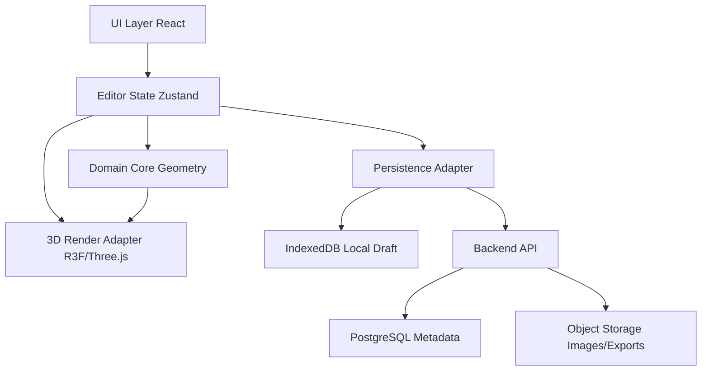
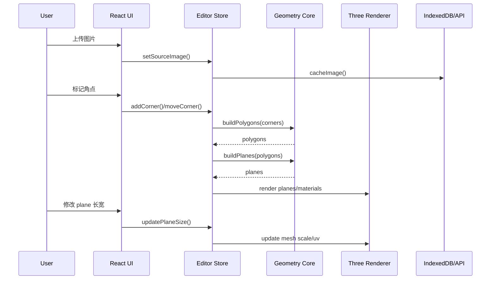
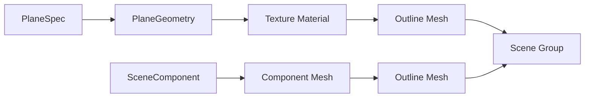
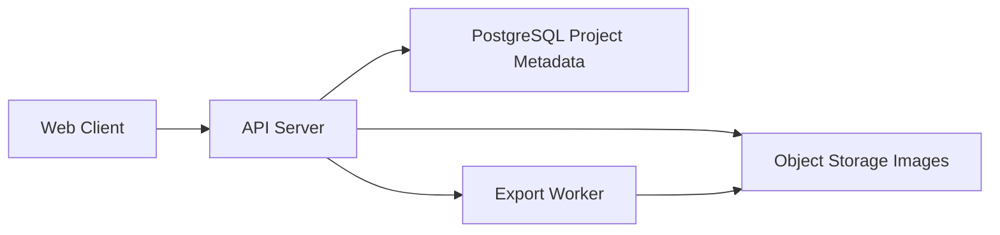
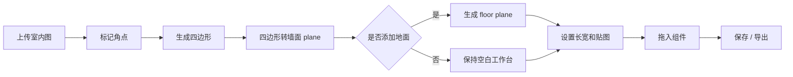

# 在线猫墙编辑器开发文档

## 1. 目标

做一个把室内照片转成可编辑 3D 猫墙场景的编辑器。

核心流程：
1. 上传室内图
2. 标记角点
3. 由角点生成四边形
4. 四边形拆成墙面 plane
5. 可选生成地面 plane
6. 调整长宽并贴图
7. 拖入组件并预览

## 2. 交互原则

- 先照片，后 3D 参数
- 先标点，后建模
- 墙面数量由四边形数量决定，不预判单面/双面/三面
- 地面是独立开关，不默认强绑定
- 主预览区保持空白工作台感，默认只显示草稿纸背景
- 所有墙面、地面、组件都要有明显描边和卡通纸片感

## 3. 页面结构

- 左侧：3D 编辑工具栏
- 中间：3D 预览主体
- 右侧：属性面板
- 底部：组件面板

初始态：
- 预览区为空白背景
- 工具栏可见
- 属性面板可见
- 组件面板可见

## 4. 技术架构

### 4.1 推荐技术栈

- 前端框架：React + TypeScript
- 构建工具：Vite
- 状态管理：Zustand
- 3D 渲染：Three.js + @react-three/fiber
- 3D 辅助：@react-three/drei
- 拖拽：dnd-kit
- 几何计算：自定义 geometry utils
- 图片与草稿持久化：IndexedDB
- 项目元数据缓存：LocalStorage
- 后端：Node.js + Fastify 或 NestJS
- 图片处理：sharp
- 数据库：PostgreSQL
- 对象存储：S3 兼容存储或本地文件存储

### 4.2 架构分层



分层说明：

- UI Layer：负责页面布局、工具栏、属性面板、组件面板
- Editor State：维护当前项目、角点、四边形、plane、选中对象、历史记录
- Domain Core：只处理几何、校验、坐标转换、UV 映射，不依赖 React
- Render Adapter：把领域数据转换成 Three.js mesh、material、outline
- Persistence Adapter：负责 IndexedDB、本地草稿、后端同步
- Backend API：负责项目保存、图片上传、导出和多人协作预留

### 4.3 前端目录建议

```txt
src/
  app/
    App.tsx
    routes.tsx
  editor/
    EditorPage.tsx
    editorStore.ts
    historyStore.ts
  features/
    upload/
    annotation/
    geometry/
    scene3d/
    properties/
    component-palette/
  domain/
    geometry/
      buildPolygons.ts
      buildPlanes.ts
      validateQuad.ts
      uvMapping.ts
      coordinate.ts
    scene/
      types.ts
      selection.ts
  persistence/
    indexedDb.ts
    projectApi.ts
    serializers.ts
  ui/
    panels/
    controls/
    icons/
```

### 4.4 架构选择理由

- React 适合做复杂面板和状态联动
- @react-three/fiber 让 Three.js 和 React 状态更好组合
- Three.js 适合 plane、材质、UV、相机和组件摆放
- Zustand 够轻，适合编辑器型状态
- dnd-kit 适合底部组件拖入场景
- IndexedDB 适合保存项目草稿和大图资源
- 后端只做存储、导出和项目管理，前端保持高响应

### 4.5 核心数据流



### 4.6 关键状态设计

编辑器状态建议集中在 `editorStore`：

```ts
type EditorState = {
  project: Project | null
  mode: EditorMode
  selectedId: string | null
  imageViewport: ImageViewport
  sceneViewport: SceneViewport
  history: HistoryEntry[]
}

type EditorMode =
  | 'empty'
  | 'image-uploaded'
  | 'marking-corners'
  | 'editing-polygons'
  | 'editing-planes'
  | 'placing-components'
```

历史记录建议单独封装，不直接保存完整图片，只保存可序列化操作：

```ts
type HistoryEntry =
  | { type: 'add-corner'; payload: CornerPoint }
  | { type: 'move-corner'; payload: { id: string; from: Vec2; to: Vec2 } }
  | { type: 'update-plane'; payload: Partial<PlaneSpec> & { id: string } }
  | { type: 'toggle-floor'; payload: { value: boolean } }
```

### 4.7 渲染管线

3D 预览不是独立数据源，只消费 `editorStore` 的 plane 和 component 数据。



渲染规则：

- 空白状态只显示草稿纸背景
- 没有 plane 时不显示任何墙面/地面模型
- plane 生成后才显示描边模型
- 每个 plane 都有一个主 mesh 和一个 outline mesh
- 选中态通过 outline 颜色、角点控制柄和属性面板联动表达

### 4.8 几何计算边界

几何模块只接受标准数据，不读 DOM，不读 React 状态。

输入：
- 图片尺寸
- 用户角点坐标
- 四边形点序
- plane 尺寸

输出：
- polygon
- plane transform
- uv 坐标
- 校验错误

几何模块必须处理：
- 点数量不足
- 四边形自交
- 点顺序反转
- 面积过小
- 重复点

### 4.9 图片贴图与 UV 映射

用户标出的四边形区域需要从原图中作为贴图区域映射到 3D plane。

实现建议：
1. 保留原图作为 `Texture`
2. 根据四边形四个点计算归一化 UV
3. 生成 plane 时绑定对应 UV 坐标
4. plane 尺寸变化只改变 mesh scale，不改变原始四边形区域
5. 如果用户重新编辑角点，再重新计算 UV

### 4.10 后端架构

后端职责：
- 项目 CRUD
- 图片上传
- 导出任务
- 资源签名 URL
- 后续多人协作预留

后端不负责第一版几何生成。几何生成放前端，保证编辑体验即时响应。



## 5. 模块拆分

### 5.1 App Shell

负责布局、面板停靠、空白状态、响应式骨架。

### 5.2 Image Upload

负责：
- 上传图片
- 图片尺寸读取
- EXIF 方向修正
- 原图缓存

### 5.3 Corner Annotation

负责：
- 在照片上添加角点
- 拖拽角点
- 吸附
- 撤销 / 重做
- 重置

### 5.4 Geometry Engine

负责把角点转成几何对象：
- polygon / quad
- wall plane
- floor plane
- UV 映射参数

### 5.5 3D Scene Renderer

负责：
- 相机
- plane mesh
- 描边材质
- 草稿纸背景
- 组件摆放预览

### 5.6 Property Panel

负责：
- plane 长宽
- 贴图状态
- 地面开关
- 当前选中对象属性

### 5.7 Component Palette

负责：
- 分类 tab
- 横向滚动列表
- 拖入场景
- 组件元数据

## 6. 数据模型

```ts
type Project = {
  id: string
  name: string
  sourceImage: {
    url: string
    width: number
    height: number
  }
  corners: CornerPoint[]
  polygons: PolygonSpec[]
  planes: PlaneSpec[]
  components: SceneComponent[]
  settings: {
    showFloor: boolean
    sketchBackground: boolean
  }
}

type CornerPoint = {
  id: string
  x: number
  y: number
  kind: 'wall' | 'floor' | 'free'
}

type PolygonSpec = {
  id: string
  pointIds: string[]
}

type PlaneSpec = {
  id: string
  type: 'wall' | 'floor'
  width: number
  height: number
  polygonId?: string
  textureUrl?: string
  uvMode: 'manual' | 'auto'
}
```

## 7. 运行流程



## 8. 渲染策略

- 墙面 plane 使用 `PlaneGeometry`
- 地面 plane 使用单独 plane
- 每个 plane 使用独立材质和独立描边
- 贴图按用户标记的四边形区域做 UV 映射
- 草稿纸背景是纯视觉层，不参与建模

## 9. 状态机

建议状态：

- `empty`
- `image-loaded`
- `marking-corners`
- `geometry-built`
- `floor-optional`
- `editing-planes`
- `dragging-components`
- `exporting`

## 10. 接口建议

### 前端本地接口

- `createProject()`
- `loadProject()`
- `updateCorners()`
- `buildPolygons()`
- `toggleFloor()`
- `updatePlaneSize()`
- `assignTexture()`
- `dragComponent()`

### 后端接口

- `POST /projects`
- `GET /projects/:id`
- `PUT /projects/:id`
- `POST /projects/:id/image`
- `POST /projects/:id/export`

## 11. 关键实现点

- 角点编辑必须支持撤销 / 重做
- 四边形生成要有校验，防止点顺序错误
- 属性面板内容超过高度时内部滚动
- 底部组件栏只负责浏览和拖拽，不承载复杂编辑
- 空白预览态必须可用，不依赖模型生成结果

## 12. 风险点

- 角点顺序混乱会直接导致四边形翻转
- 图片透视太强时，手工点位会增加误差
- plane 数量和层级关系复杂时，选中态容易错乱
- 组件拖入后需要明确父子层级和吸附规则

## 13. 建议的第一版范围

第一版先做：
- 上传图片
- 角点标记
- 四边形生成
- 墙面 plane 预览
- 地面开关
- 长宽调节
- 组件拖入占位

先不做：
- 自动识别墙体数量
- 自动语义分割
- 高级光照
- 复杂材质库
- 多房间切换

## 14. 当前实现总结（2026-07-01）

当前版本已经从“角点四边形生成 plane”的第一版原型，演进为“透视标线 + 模板 + 3D 变换编辑”的工作台。原先的四点墙面流程仍保留为兼容流程，但优先流程已经改为上传室内图后绘制左向线、右向线、可选竖向线和标尺，再由透视关系生成相机、墙面和地面。

### 14.1 已完成的功能

- 图片上传、替换、删除：用于创建室内图草稿，图片尺寸会进入标注坐标换算和贴图映射。
- 透视标线：支持左向线、右向线、竖向线，用于求消失点、估算 FOV、相机 yaw/pitch，并生成透视墙面。
- 标尺：支持输入真实长度，用于把透视线段的像素长度换算为实际尺寸；生成 3D 模型时会优先使用测量出的墙宽、墙高。
- 四点墙面兼容流程：仍可按四个角点一组生成旧版墙面四边形，作为没有透视线时的 fallback。
- 墙面模板：支持单面墙、双墙夹角、三墙夹角，不上传图片时也能快速生成 3D 场景。
- 厚度墙体：墙面和地面不再是零厚度 plane，而是带少量厚度的 box geometry，便于观察边缘和开口方向。
- 地面常驻：生成模型时始终带地面，地面尺寸需要覆盖墙体范围；旧版地面启用开关已不再作为主交互。
- 3D 操作工具栏：进入 3D 场景后左侧显示常驻小图标工具栏，支持选择、移动、旋转、撤销、重做、删除。
- 快捷键：底部显示 Q 选择、W 移动、E 旋转、D 删除、Esc 退出、Ctrl+Z 撤销、Ctrl+Y 重做。
- 3D 视图操作：左键旋转、滚轮缩放、右键拖动平移；默认相机已后移，让主体大约占画面横向 1/2。
- 属性面板：右侧折叠为细长按钮栏，鼠标悬停或聚焦时打开详细面板，可精确输入位置、旋转、尺寸和贴图状态。
- 组件面板：底部组件面板支持分类浏览和拖拽组件进入 3D 场景，目前组件以占位 box 渲染。

### 14.2 当前核心代码结构

- `src/editor/EditorPage.tsx`：页面组合入口，负责 DnD 根节点、场景 drop zone、上传/模板区、标注层、3D 场景和四个浮动面板。
- `src/editor/editorStore.ts`：Zustand 状态中心，维护项目数据、模式、选中对象、透视线、标尺、planes、components、history 和 3D transform mode。
- `src/domain/geometry/perspective.ts`：透视标线建模核心，负责求消失点、估算相机、根据标尺计算墙面实际尺寸并生成透视墙面。
- `src/domain/geometry/wallTemplates.ts`：单墙、双墙、三墙模板的几何生成。
- `src/features/annotation/AnnotationLayer.tsx`：图片上的透视线、标尺、角点等 2D 标注交互。
- `src/features/scene3d/SceneCanvas.tsx`：React Three Fiber 场景、厚墙体 geometry、相机、OrbitControls、TransformControls、组件占位 mesh。
- `src/features/properties/PropertyPanel.tsx`：右侧属性按钮栏和悬浮详细编辑面板。
- `src/features/component-palette/ComponentPalette.tsx`：底部组件分类、卡片和拖拽源。
- `src/ui/panels/Toolbar.tsx`：2D 标注工具栏和 3D 小图标操作栏。
- `src/ui/panels/ShortcutBar.tsx`：快捷键提示和键盘事件绑定。

### 14.3 组件系统现状

组件系统已经从底部面板硬编码列表升级为独立组件 catalog 和管理页。组件管理页访问地址为 `/components_manager`，实现文件是 `src/features/components-manager/ComponentsManagerPage.tsx`。组件 catalog 位于 `src/domain/scene/componentCatalog.ts`，通过 Zustand persist 保存到 `cat-wall-component-catalog`，当前版本为 `3`。

组件库按放置规则固定分为三大类：

- `wall`：墙面组件，后续必须与墙面有接触面。
- `floor`：地面组件，后续必须与地面有接触面。
- `free`：自由组件，后续可以不绑定墙面或地面。

每个大类下可以自由添加和删除子类。子类只做筛选和类型细分，不改变组件放置规则。点击大类时显示该大类下全部组件，点击子类时只显示该子类下组件。新增和编辑组件使用弹出层表单。

当前 `ComponentCatalogItem` 已包含：

- 基础展示：`kind`、`label`、`detail`、`icon`
- 分类与放置：`placement`、`subcategoryId`
- 默认形态：`defaultSize`、`defaultRotation`、`fallbackColor`
- 资产预留：`assetKey`、`assetUrl`
- 采购信息：`purchaseUrls`、`referencePrice`
- 专属属性：`propertySchema`

底部组件面板 `src/features/component-palette/ComponentPalette.tsx` 已改为读取 catalog，并按 `wall` / `floor` / `free` 过滤。拖拽仍使用 `@dnd-kit/core`，drop 区在 `EditorPage.tsx` 里用 `useDroppable({ id: 'scene-drop-zone' })` 注册。当前 drop 成功后仍只调用 `editorStore.addComponent(kind)`，还没有把鼠标落点转换成 3D 命中点。

`SceneComponent` 已支持 `placement`、`targetPlaneId`、`position`、`rotation`、`scale`、`size`、`material` 和 `params`。`editorStore.addComponent()` 当前会根据 catalog placement 选择合法目标：墙面组件只绑定 wall plane，地面组件只绑定 floor plane，自由组件不绑定 plane。`SceneCanvas.tsx` 的 `ComponentMesh` 已使用 catalog 的默认尺寸和 fallback 颜色渲染占位 box。右侧属性面板已支持编辑组件位置、旋转、尺寸、占位颜色和 `propertySchema` 参数。

当前仍未完成真实场景互动：drop 后没有 raycast 落点，没有贴墙/落地接触面计算，没有边界 clamp，没有 TransformControls 约束，也没有使用 `assetKey` / `assetUrl` 加载真实模型。组件与场景互动的详细交接和开发步骤见 `docs/cat-wall-component-system-handoff-2026-07-04.md`。

### 14.4 组件与场景互动开发原则

后续组件互动开发应以三大放置规则为核心，而不是以 UI 子类为核心：

- 墙面组件：必须命中 wall plane，组件背面贴墙，中心点沿墙面法线向房间内偏移半个深度，移动时只能在墙面范围内移动。
- 地面组件：必须命中 floor plane，组件底面落地，中心点沿地面法线向上偏移半个高度，移动时只能在地面范围内移动。
- 自由组件：不强制绑定 plane，可用命中点作为初始位置，但后续移动旋转不受 wall / floor 规则约束。

推荐新增 `src/domain/scene/componentPlacement.ts`，把 raycast 命中、接触面计算、position/rotation 对齐、边界 clamp 和 transform 约束从 UI 与 store 中拆出来。`EditorPage` 负责传递 dnd-kit drop 的屏幕坐标，`SceneCanvas` 内部负责用 R3F 的 camera、gl、scene 和 raycaster 解析命中，`editorStore` 只负责创建和保存最终的 `SceneComponent`。
